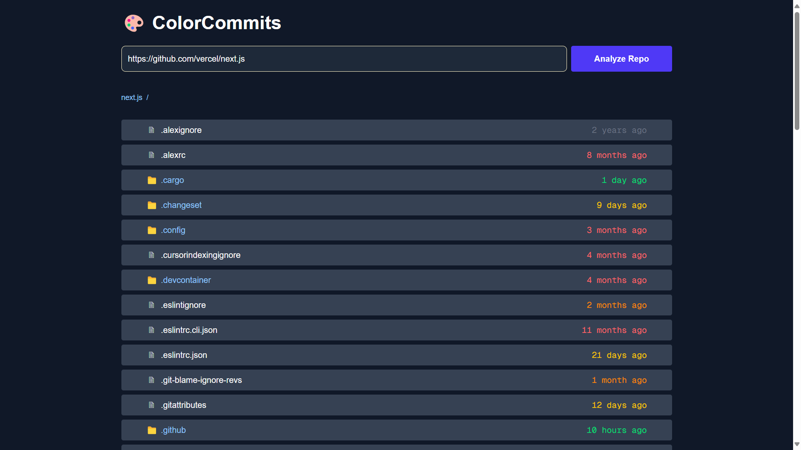
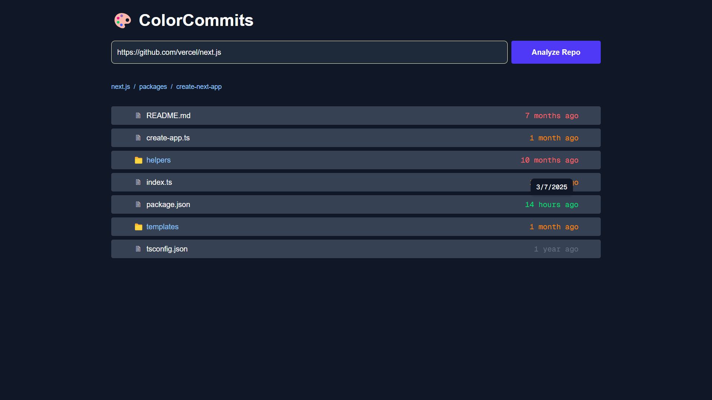
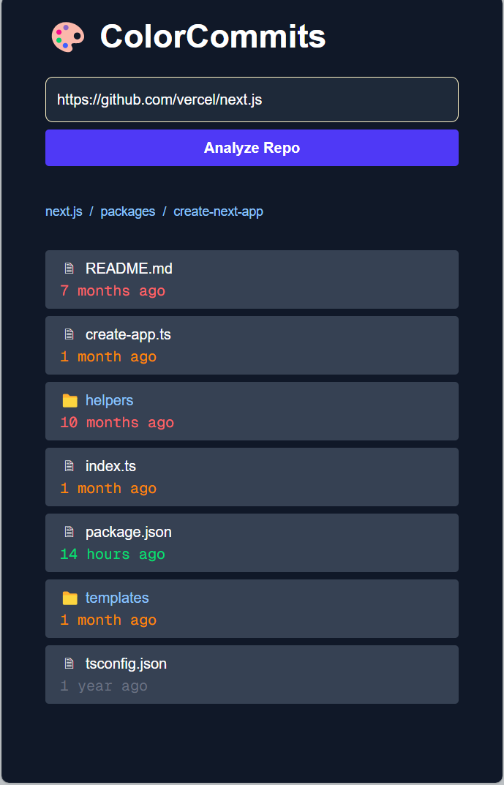

# 🎨 ColorCommits 

## https://color-commits.netlify.app/

ColorCommits is a web app that visualizes the recency of commits for files and folders in any public GitHub repository. It uses color coding to indicate how recently each file or directory was updated, helping you quickly spot stale or active parts of a codebase.

## Features

- 🌈 **Color-coded commit ages**: Instantly see which files are fresh or stale.
- 🗂️ **Browse folders**: Navigate through repository directories.
- 🕒 **Tooltip with commit dates**: Hover to see the exact last commit date.
- 🔗 **Paste any GitHub repo URL**: Works with any public repository.

## Gallery







## Getting Started

### Prerequisites

- [Node.js](https://nodejs.org/) (v18 or newer recommended)
- [npm](https://www.npmjs.com/) or [yarn](https://yarnpkg.com/)

### Installation

1. Clone the repository:
   ```sh
   git clone https://github.com/your-username/color_commits.git
   cd color_commits
   ```

2. Install dependencies:
   ```sh
   npm install
   # or
   yarn install
   ```

3. Create a `.env` file in the root directory and add your GitHub token:
   ```
   NEXT_PUBLIC_TOKEN=your_github_token_here
   ```
   > **Note:** A GitHub token is required to avoid API rate limits. You can create one at [github.com/settings/tokens](https://github.com/settings/tokens).

### Running the App

Start the development server:

```sh
npm run dev
# or
yarn dev
```

Open [http://localhost:3000](http://localhost:3000) in your browser.

## Usage

1. Paste a GitHub repository URL (e.g., `https://github.com/vercel/next.js`) into the input field.
2. Click **Analyze Repo**.
3. Browse the file tree and see color-coded commit ages.

## Tech Stack

- [Next.js](https://nextjs.org/)
- [React](https://react.dev/)
- [Tailwind CSS](https://tailwindcss.com/)
- [Github Rest API](https://docs.github.com/en/rest)

## Project Structure

```
src/
  app/           # Next.js app directory
  components/    # UI components (Form, Loader, FileList, Breadcrumbs)
  hooks/         # Custom React hooks
  utils/         # Helper functions
public/          # Static assets
```

## License

MIT

---

Made with ❤️ by Shubham Verma.